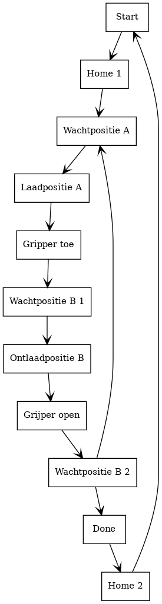

# 1 Omschrijving

## 1.1 
In mijn project ga ik met de Fanuc robotcell een loop programma schrijven, Dit
programma zou bijvoorbeeld in productie omgevingen kunnen dienen voor het vullen
van vaten. 

## 1.2 
Er zijn 2 zijden aan het werkstation. Zijde A is waar de operatoren zich
bevinden. De operatoren moeten lege vaten aanleveren voor het vulprocess. Aan
zijde B is de loading dock waar enkel heftrucks zich mogen verplaatsen. De
heftrucks gaan de vaten van zijde B lossen en naar hun volgende locatie brengen. 

Vanaf het moment dat de operatoren zijde A voorzien hebben van nieuwe vaten en
zijde B is ook leeg gehaald door de heftruck chauffeurs, kan er een start
commando gegeven worden aan de installatie. Eenmaal als het vulprocess is
beïndigd zal er een start signaal aan de robot gegeven worden. Hierop gaat de
robot elk vat één voor één halen en het gevulde vat in de respectievelijke
gespiegelde positie plaatsen aan zijde B. Eenmaal als alle vaten omgezet zijn
gaat de robot zich naar zijn home positie begeven. 

## 1.3
De robot vertrekt steeds vanuit zijn home positie. in het begin en het einde van
het programma wordt de robot steeds naar zijn home positie gestuurd worden. Dit
met het gedacht dat de robot ook al wordt het programma onderbroken nog steeds
vanuit zijn home positie gaat vertrekken.
Eenmaal dat de robot een start commando heeft ontvangen zal hij eerst vanuit
zijn register enkele belangrijke posities laden. Deze posities zijn namelijk: 
- Wachtpositie zijde A
- Laadpositie zijde A
- Wachtpositie zijde B
- Ontlaadpositie zijde B

Deze posities zijn de enigste posities die geteached kunnen worden.

Vanaf hier gaan we 2 loop programma's starten. 1 Loop voor het aantal rijen af
te gaan. De andere loop voor elk vat dat er per rij is. 
De variable voor het aantal vaten wordt bij elke iteratie gedecrementeerd met 1. 

Bij de eerste opdracht in de loop wordt Wachtpositie zijde A aangereden. Deze 
wachtpositie is net boven het te nemen vat. zodoende we met een rechtlijnige 
neerwaartse beweging het vat kunnen nemen, en zo de kans op het omstoten 
te verminderen. 
Dan beweegt de robot zich naar laadpositie A en sluit zijn grijper bij het
aankomen op deze positie. Nu beweegt de robot zich via wachtpositie A naar wacht
positie B voor het neerzetten van het vat. Eenmaal wachtpositie B bereikt zal de
robot wederom in een rechtlijnige beweging naar beneden het vat neer zetten. 
De grijper wordt gelost en de robot rijdt terug naar wachtpositie B. 
Nu zijn we aan het einde van loop aangekomen. 
Dit wordt herhaald totdat alle vaten overgezet zijn.

# 2 Technische documentatie

## 2.1 Software

### 2.1.1 Flowchart

### 2.1.2 Code

#### 2.1.2.1 Totale code

#### 2.1.2.2 Code snippets

- inlezen start positie
- Forloops
- aanpassen van positie

### 2.1.3 Variabelen en IO-lijst

# 3 Media
Ik heb een github repository aangemaakt met daarin de vooruitgang van mijn
project.
https://github.com/JoVdv/Robotica

# 4 Simulatie

# 5 Checklist skills

# 6 Checklist requirements
